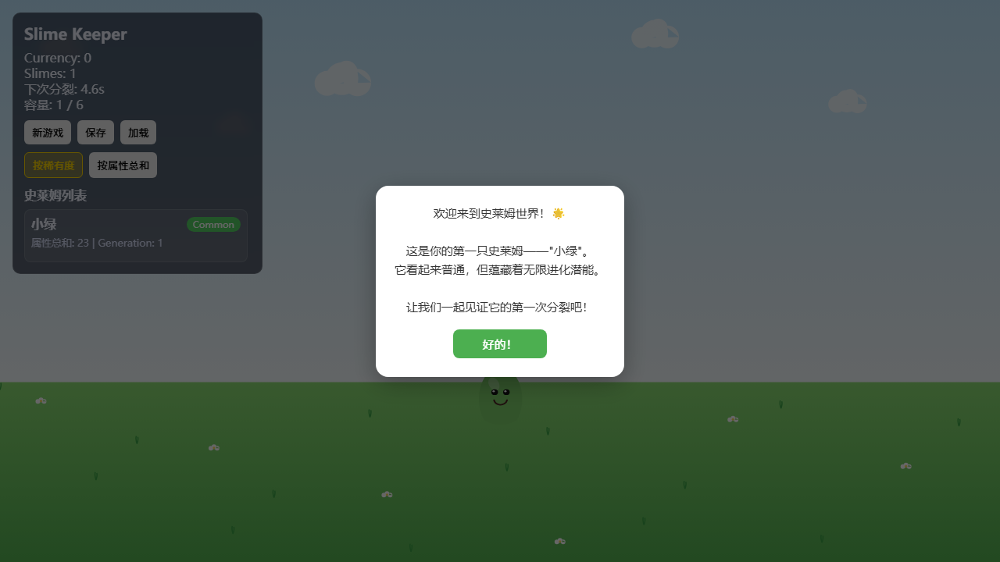
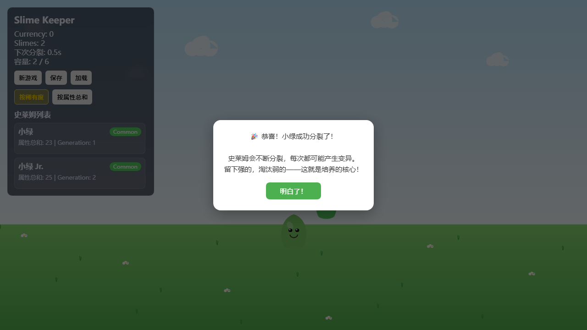
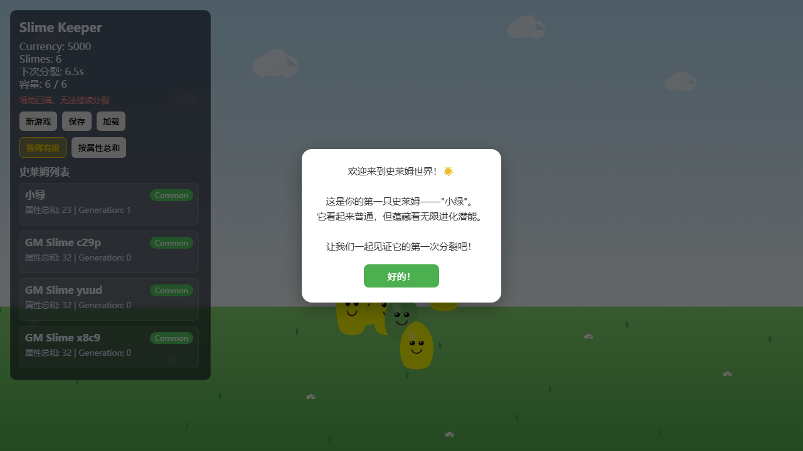
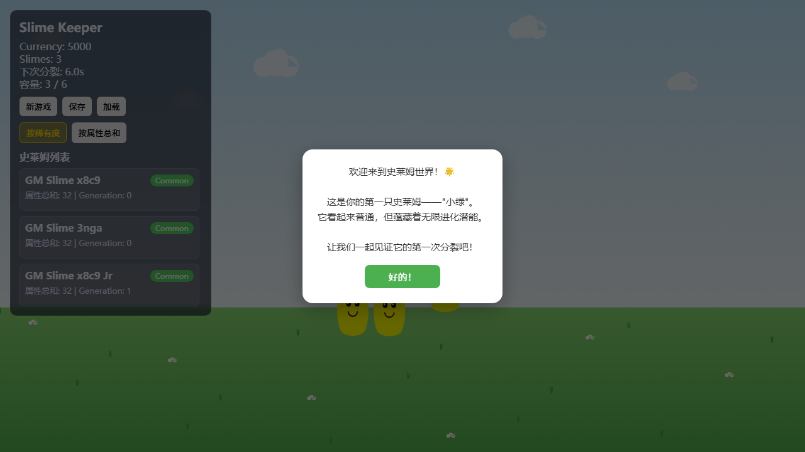

# 史莱姆进化 (Slime Keeper)

一款 Web 放置养成 + 回合制战斗游戏。培育史莱姆、筛选精英、组队挑战关卡，循环进化你的史莱姆军团。

> 🎮 **[在线体验](https://Lynkzhang.github.io/AFK/)**

## 游戏截图

| 主界面 | 史莱姆分裂 |
|:---:|:---:|
|  |  |

| 史莱姆管理 | 设施升级 |
|:---:|:---:|
|  |  |

| 关卡选择 |
|:---:|
|  |

## 技术栈

| 技术 | 用途 |
|------|------|
| **Vite** | 构建与开发服务器 |
| **TypeScript** | 全项目类型安全 |
| **Canvas 2D** | 2D 场景渲染（史莱姆可视化） |
| **Playwright** | E2E 端到端测试 |

## 快速开始

### 环境要求

- Node.js ≥ 18
- npm ≥ 9

### 安装

```bash
git clone <repo-url>
cd repo/repo
npm install
```

### 开发模式

```bash
npm run dev
```

浏览器打开 `http://localhost:5173` 即可游玩。

### 构建

```bash
npm run build
```

产物输出到 `dist/`，可直接部署到任何静态文件服务器。

### 预览构建产物

```bash
npm run preview
```

## 测试

项目使用 Playwright 进行 E2E 测试（共 66 个用例）。

```bash
# 安装浏览器（首次需要）
npx playwright install

# 运行全部测试
npx playwright test

# 运行单个测试文件
npx playwright test e2e/game.spec.ts

# 查看测试报告
npx playwright show-report
```

## 项目结构

```
repo/
├── index.html              # 入口 HTML
├── vite.config.ts          # Vite 构建配置（base=/AFK/）
├── package.json            # 依赖与脚本
├── tsconfig.json           # TypeScript 配置
├── playwright.config.ts    # Playwright 配置
├── public/                 # 静态资源（图标等）
├── screenshots/            # 游戏截图
├── e2e/                    # E2E 测试用例
│   └── game.spec.ts        # 66 个端到端测试
└── src/
    ├── main.ts             # 应用入口，初始化各系统
    ├── style.css           # 全局样式
    └── core/
        ├── types.ts        # 全局类型定义
        ├── combat/         # 战斗系统
        │   ├── CombatEngine.ts     # 回合制战斗引擎
        │   ├── CombatTypes.ts      # 战斗相关类型
        │   ├── CombatConstants.ts  # 战斗数值常量
        │   ├── EnemyAI.ts          # 敌人 AI 逻辑
        │   └── StageData.ts        # 3章30关关卡数据
        ├── data/           # 静态数据
        │   ├── skills.ts           # 技能定义
        │   └── traits.ts           # 特性定义
        ├── debug/          # 调试工具
        │   └── GMCommands.ts       # GM 命令（开发者控制台）
        ├── save/           # 存档系统
        │   └── SaveManager.ts      # localStorage 存读档
        ├── scene/          # 2D 场景
        │   ├── Canvas2DRenderer.ts # Canvas 2D 场景渲染
        │   └── SceneManager.ts     # 场景管理（已弃用）
        ├── systems/        # 核心游戏系统
        │   ├── BreedingSystem.ts   # 繁殖/分裂系统
        │   ├── MutationEngine.ts   # 变异引擎
        │   ├── EvaluationSystem.ts # 史莱姆估价
        │   ├── ArchiveSystem.ts    # 封存系统
        │   ├── FacilitySystem.ts   # 设施升级
        │   ├── ShopSystem.ts       # 商店系统
        │   ├── ItemSystem.ts       # 道具系统
        │   └── GameLoop.ts         # 主循环
        └── ui/             # UI 组件
            ├── UIManager.ts        # 主界面管理
            ├── BattleUI.ts         # 战斗界面
            ├── StageSelectUI.ts    # 章节/关卡选择
            ├── TeamSelectUI.ts     # 出战编队
            ├── ArchiveUI.ts        # 封存库界面
            ├── FacilityUI.ts       # 设施升级界面
            └── ShopUI.ts           # 商店界面
```

## GM 命令（开发者模式）

在浏览器控制台（F12）中通过 `window.__GM` 访问：

```js
__GM.addSlime()              // 添加一只 GM 史莱姆
__GM.removeSlime(id)         // 删除指定史莱姆
__GM.setStats(id, {attack:99})// 修改属性
__GM.triggerSplit()          // 立即触发一次分裂
__GM.setCurrency(9999)       // 设置金币
__GM.setCrystal(999)         // 设置晶石
__GM.startBattle('1-1')      // 开始战斗（关卡ID格式：章-关）
__GM.autoBattle('1-1')       // 自动战斗
__GM.archiveSlime(id)        // 封存史莱姆
__GM.unarchiveSlime(id)      // 取回封存
__GM.upgradeFacility(id)     // 升级设施
__GM.buyItem(shopItemId)     // 购买商店道具
__GM.useItem(itemType, id?)  // 使用道具
__GM.unlockChapter(n)        // 解锁第 n 章
__GM.getState()              // 查看完整游戏状态
```

## 许可证

私有项目，未经授权不得分发。
